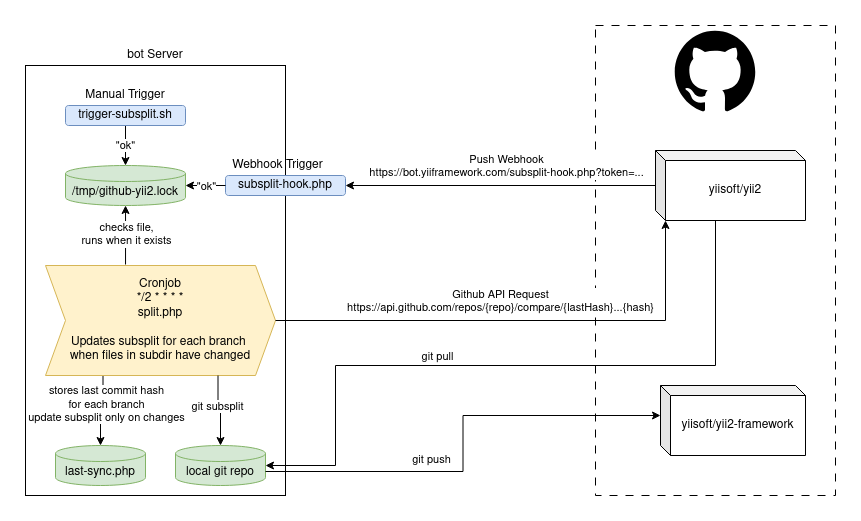

Yii Git Repository Subsplit
===========================

The Subsplit Tool creates a git subsplit from a subdirectory of the main git repo.

How it works
------------



Source and target repository:

* The main repository is `yiisoft/yii2`.
* The `framework` directory is creating a sub-repo, which is `yiisoft/yii2-framework`.
* The goal is to keep the framework repo automatically updated from a subdirectory of the main repo.

There are two ways to trigger subsplit:

* **Manual trigger**: running `trigger-subsplilt.sh` on the bot server.
* **Automatic trigger**: a GitHub push webhook calls `subsplit-hook.php` on the bot server.

Both triggers create a "lock" file: `/tmp/github-yii2.lock`. This is not acutally a lock file but rather a trigger file.
If the file exists, the subsplit process is allowed to run.

A lock for preventing concurrent runs exists separately from that: `sync.lock`

A cronjob runs every 2 minutes:

```
*/2 * * * * split.php
```

The cron checks for the lock file and starts processing if present.

* The bot server performs a `git pull` on the local mirror of `yiisoft/yii2`.
* For each tracked branch:

  * The script compares the **last processed commit** with the current state.
  * It uses the **GitHub Compare API**:

      ```
      /repos/{repo}/compare/{lastHash}...{hash}
      ```
  * It checks whether files inside the subdirectory (framework code) have changed.
  * The last processed commit hash for each branch is stored in: `last-sync.php`  
    This ensures:
    
    * Subsplit runs only when relevant files change
    * No unnecessary pushes occur

  * If changes are detected it runs `git subsplit` for the affected branch and subdirectory.
  * The subsplit output is pushed (`git push`) to `yiisoft/yii2-framework`
  * Each branch is updated independently.


Setup
-----

Setup the bot after applying the salt states:

- add the SSH public key of yii-bot to the yiisoft/yii2-framework repo as deploy-key with push access
- add webhook to `yiisoft/yii2` to ping `https://bot.yiiframework.com/subsplit-hook.php?token=...` on push (token is the one defined in `yiibot.github_subsplit_secret` saltstack pillar)


